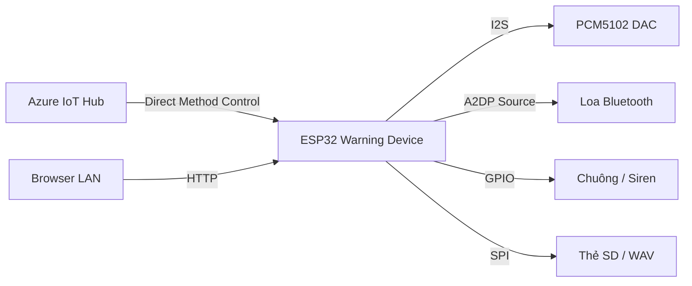

# Warning Device

Firmware **ESP32** cho thiết bị cảnh báo: phát loa (DAC I2S / Bluetooth A2DP), chuông GPIO, điều khiển từ **Azure IoT Hub**, cấu hình qua web LAN và quản lý file âm thanh trên thẻ SD.

| | |
|---|---|
| **MCU** | ESP32 |
| **Framework** | ESP-IDF v5.3.x |
| **Version** | 2.0.0 (`PROJECT_VER`) |
| **Cloud** | Azure IoT Hub (MQTT + Direct Method) |
| **Audio** | PCM5102 (I2S) hoặc loa BT (A2DP Source) |

---

## Tính năng chính

- **Hai chế độ loa** — SW2 = DAC I2S (PCM5102), SW3 = Bluetooth A2DP Source (ưu tiên SW2 nếu cả hai ON)
- **Azure Direct Method `Control`** — phát/dừng alarm, chuông, OTA, download/xóa/list file SD, health snapshot
- **Web config** — WiFi / Azure / ghép loa BT / quản lý audio trên SD (`http://<device-ip>/`)
- **Config mode (SW1)** — SoftAP + STA để cấu hình khi chưa có WiFi
- **LED trạng thái** — Config / WiFi·Azure / Audio (Active LOW)
- **OTA firmware** — Code `501` từ cloud

---

## Kiến trúc tổng quan



| Module | File chính | Vai trò |
|--------|------------|---------|
| Boot / Switch / LED | `main/main.c` | Chế độ audio, monitor gạt nóng |
| Azure | `main/user_azure.c` | MQTT, Direct Method |
| Bluetooth | `main/user_bluetooth.c` | A2DP Source + reconnect |
| DAC I2S | `main/DAC_I2S.c` | Phát PCM ra DAC |
| Alarm / Bell | `main/user_excute_audio.c` | Queue phát WAV, chuông GPIO |
| HTTP | `main/user_http_server.c` | UI cấu hình + audio |
| SD / file | `main/user_sdcard.c`, `user_audio_files.c` | Lưu / tải WAV |
| OTA | `main/user_ota.c` | Cập nhật firmware |

---

## Phần cứng — Switch & LED

Switch / LED đều **Active LOW** (ON = kéo GND / LED sáng khi GPIO = `0`).

| Chân | GPIO | Chức năng |
|------|------|-----------|
| SW1 | 13 | Config / SoftAP |
| SW2 | 12 | DAC I2S *(strapping — xem lưu ý bên dưới)* |
| SW3 | 14 | Bluetooth A2DP |
| SW4 | 27 | Dự phòng |
| LED1 | 33 | Config mode (nháy) |
| LED2 | 25 | WiFi / Internet / Azure |
| LED3 | 26 | Audio (phát / DAC / BT) |

### Ý nghĩa LED

| LED | Tắt | Sáng cố định | Nháy chậm | Nháy nhanh |
|-----|-----|--------------|-----------|------------|
| **LED2** | Không WiFi | Có WiFi, chưa internet | Có internet, chưa Azure | Internet + Azure |
| **LED3** | Không phát / BT chưa connect | SW2 DAC ON | SW3 BT đã A2DP | Đang phát alarm |

> **Lưu ý SW2 (GPIO12):** chân strapping. Nếu SW2 OFF (pull-up → HIGH) lúc reset, board có thể không boot với flash 3.3V. Giữ SW2 ON khi cần boot ổn định, hoặc thiết kế phần cứng kéo đúng mức lúc reset.

### Audio mode

| SW2 | SW3 | Kết quả |
|-----|-----|---------|
| ON | * | DAC I2S |
| OFF | ON | Bluetooth A2DP |
| OFF | OFF | Không khởi tạo audio |

**Gạt nóng SW3:** stack BT được deinit/init lại. Loa (vd. AW-TREK) có thể không trả lời page ngay (`ACL status 260`) — đợi 20–30s, tắt/bật loa, hoặc reboot ESP. Tránh gạt liên tục khi đang connect.

---

## Build & Flash

### Yêu cầu

- [ESP-IDF](https://docs.espressif.com/projects/esp-idf/en/v5.3.4/esp32/get-started/index.html) **v5.3.x**
- Target: **ESP32**
- Python env của Espressif (Windows / Linux / macOS)

### Lệnh

```bash
# Trong môi trường ESP-IDF đã export
idf.py set-target esp32
idf.py build
idf.py -p COMx flash monitor   # Windows: COM8, Linux: /dev/ttyUSB0
```

Thoát monitor: `Ctrl+]`

### Cấu hình Bluetooth (nếu cần)

```bash
idf.py menuconfig
```

Bật Classic Bluetooth + A2DP (Bluedroid) — thường đã có trong `sdkconfig` của project.

---

## Cấu hình thiết bị

1. Gạt **SW1 ON** → vào Config mode (SoftAP + STA)
2. Kết nối WiFi AP của thiết bị / mở web UI
3. Nhập WiFi STA, Azure IoT Hub (hostname, deviceId, symmetric key)
4. (BT) Scan & lưu loa Bluetooth trên web → ghi NVS
5. Gạt SW1 OFF → reboot vào chế độ thường

Web UI bình thường (đã có WiFi): `http://<IP-thiết-bị>/`

---

## Azure Direct Method — `Control`

**Method name:** `Control`  
**Content-Type:** `application/json`

Envelope chung:

```json
{
  "Code": 100,
  "TimeStamp": 1744520000,
  "Data": { }
}
```

| Code | Ý nghĩa |
|------|---------|
| **100** | Phát / dừng alarm WAV trên SD |
| **101** | Bật / tắt chuông (GPIO) |
| **106** | Health snapshot → response **Code 300** |
| **501** | OTA firmware (HTTPS `.bin`) |
| **600** | Download audio HTTPS → SD |
| **601** | Xóa file audio trên SD |
| **602** | List file audio trên SD |

### Ví dụ — phát alarm (Code 100)

```json
{
  "Code": 100,
  "TimeStamp": 1744520000,
  "Data": {
    "Value": 1,
    "PondId": 1,
    "DeviceId": 21,
    "Duration": 10,
    "Repeat": 1
  }
}
```

→ file `/sdcard/{PondId*100+DeviceId}.wav` (vd. `121.wav`).  
`Value: 0` = dừng ngay. Có thể dùng `FileName` thay cho PondId/DeviceId.

### Ví dụ — health (Code 106 → 300)

Speaker = ON nếu đang DAC mode, hoặc BT mode + A2DP connected. Bell luôn ON trong snapshot hiện tại.

Chi tiết đầy đủ: [`docs/azure-backend-direct-method-Control.txt`](docs/azure-backend-direct-method-Control.txt)  
Audio 600/601/602: [`docs/azure-backend-audio-600-601-602.txt`](docs/azure-backend-audio-600-601-602.txt)

### Thứ tự khuyến nghị khi thay file rồi phát

1. `601` xóa (tuỳ chọn) → `600` download  
2. Đợi download xong  
3. `100` play  

Không gửi `100` khi `600` còn đang tải cùng file.

---

## Cấu trúc thư mục

```
warning_device/
├── main/                 # Firmware ứng dụng
│   ├── main.c
│   ├── user_azure.*
│   ├── user_bluetooth.*
│   ├── user_excute_audio.*
│   ├── user_http_server.*
│   ├── DAC_I2S.*
│   └── ...
├── components/           # Azure middleware, MQTT, SDK
├── config/               # azure_iot_config.h
├── docs/                 # API backend & thiết kế
├── spiffs/               # Partition SPIFFS (nếu dùng)
├── CMakeLists.txt
└── README.md
```

---

## Đẩy code lên GitHub

Repo hiện tại: `https://github.com/MebiEco/Warning_device.git`

```bash
# 1. Xem thay đổi
git status
git diff

# 2. Chỉ stage file nguồn (KHÔNG stage build/)
git add README.md main/ docs/

# 3. Commit
git commit -m "docs: rewrite README for Warning Device firmware"

# 4. Push lên origin
git push -u origin main
```

### Nên / không nên commit

| Commit | Không commit |
|--------|--------------|
| `main/`, `docs/`, `README.md`, `sdkconfig` (nếu cố ý share) | `build/` (bin, elf, map, ninja, clangd index) |
| `CMakeLists.txt`, `partitions*.csv` | secret Azure key, mật khẩu WiFi trong source |

Project nên có `.gitignore` gốc để bỏ qua `build/`. Nếu `build/` đã từng được track, gỡ khỏi index (không xóa local):

```bash
git rm -r --cached build/
git commit -m "chore: stop tracking build artifacts"
```

---

## Troubleshooting nhanh

| Hiện tượng | Gợi ý |
|------------|--------|
| SW2 ON nhưng LED3 không sáng | LED Active LOW — firmware mới dùng `LED_ON=0` |
| Gạt nóng SW3 không reconnect BT | Đợi / tắt-bật loa / reboot ESP (page timeout 260) |
| Alarm không nghe (BT) | Kiểm tra A2DP connected (LED3 nháy chậm) trước khi `100` |
| Download 600 lỗi | URL phải `https://`; tên file FAT 8.3 (`121.wav`) |
| Board không boot | Kiểm tra GPIO12 (SW2) lúc reset |

---

## License / liên hệ

Nội bộ dự án **MebiEco — Warning Device**.  
Issues / PR: [github.com/MebiEco/Warning_device](https://github.com/MebiEco/Warning_device)
